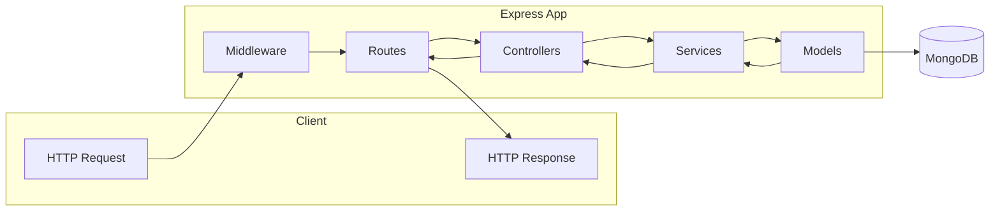

# Complete JWT Auth & User Management — Implementation Plan

This plan builds on your existing [package.json](package.json) (Express, TypeScript, nodemon). No `src/` or auth code exists yet, so we start from project structure and add each layer in order.

---

## Architecture Overview



- **Routes** — Define URL paths and HTTP methods; delegate to controllers.
- **Controllers** — Parse request, call services, format response (no business logic).
- **Services** — Business logic (hashing, token creation, DB operations).
- **Models** — Mongoose schemas and TypeScript types.
- **Middleware** — Auth (JWT verify), validation, error handling, CORS, rate limit.

Think of it like frontend: Routes = router config, Controllers = page/component logic, Services = API/data layer, Models = types + DB shape.

---

## 1. Dependencies and Environment

**Install:**

```bash
npm install mongoose bcryptjs jsonwebtoken dotenv cors express-rate-limit
npm install -D @types/bcryptjs @types/jsonwebtoken
```

**Validation:** Use **Zod** for type-safe validation and inferred TypeScript types (fits TS well):

```bash
npm install zod
```

(Alternatives: Joi or express-validator; Zod keeps schema and types in one place.)

**Environment:** Create `.env` (never commit) and `.env.example` (commit):

| Variable             | Purpose                                                                       |
| -------------------- | ----------------------------------------------------------------------------- | ---------- |
| `PORT`               | Server port (e.g. 5000)                                                       |
| `MONGODB_URI`        | MongoDB connection string                                                     |
| `JWT_ACCESS_SECRET`  | Secret for access tokens                                                      |
| `JWT_REFRESH_SECRET` | Secret for refresh tokens                                                     |
| `JWT_ACCESS_EXPIRY`  | e.g. 15m                                                                      |
| `JWT_REFRESH_EXPIRY` | e.g. 7d                                                                       |
| `NODE_ENV`           | development                                                                   | production |
| `CORS_ORIGIN`        | Allowed frontend origin (e.g. [http://localhost:3000](http://localhost:3000)) |

Load with `dotenv` at app entry (e.g. `src/index.ts`).

---

## 2. Folder Structure

```
jwt-auth-backend/
├── src/
│   ├── index.ts                 # App entry: DB connect, mount routes, start server
│   ├── app.ts                   # Express app creation, middleware (CORS, JSON, rate-limit, routes)
│   ├── config/
│   │   └── env.ts               # Validate and export env variables (using Zod)
│   ├── models/
│   │   ├── User.model.ts        # Mongoose User schema
│   │   └── RefreshToken.model.ts # Optional: refresh token storage
│   ├── types/
│   │   └── index.ts             # Shared types (User, JwtPayload, ApiResponse, etc.)
│   ├── middleware/
│   │   ├── auth.middleware.ts   # JWT verify, attach user to request
│   │   ├── validate.middleware.ts # Run Zod (or other) validation
│   │   ├── errorHandler.middleware.ts # Global error handler
│   │   └── optional: admin.middleware.ts # Require role === 'admin'
│   ├── routes/
│   │   ├── index.ts             # Combine auth + user routes
│   │   ├── auth.routes.ts       # POST /signup, /login, /logout, /refresh
│   │   └── user.routes.ts       # GET/PATCH/DELETE profile, GET /users (admin)
│   ├── controllers/
│   │   ├── auth.controller.ts
│   │   └── user.controller.ts
│   ├── services/
│   │   ├── auth.service.ts      # signup, login, logout, refresh
│   │   └── user.service.ts      # getProfile, updateUser, deleteUser, getAllUsers
│   └── validators/
│       ├── auth.validator.ts   # Zod schemas for signup, login
│       └── user.validator.ts   # Zod schemas for update user
├── .env
├── .env.example
├── package.json
├── tsconfig.json
└── .gitignore
```

**tsconfig:** Uncomment and set `"rootDir": "./src"` and `"outDir": "./dist"` in [tsconfig.json](tsconfig.json) so `npm run build` outputs to `dist/`. Ensure `"types": ["node"]` (or include `@types/node`) so Node/Express types resolve.

---

## 3. API Routes List

| Method | Route               | Auth           | Description                                                          |
| ------ | ------------------- | -------------- | -------------------------------------------------------------------- |
| POST   | `/api/auth/signup`  | No             | Register; body: name, email, password                                |
| POST   | `/api/auth/login`   | No             | Login; body: email, password; returns access + refresh tokens        |
| POST   | `/api/auth/logout`  | Yes (optional) | Invalidate refresh token (if stored in DB) or client discards tokens |
| POST   | `/api/auth/refresh` | Refresh token  | Issue new access (and optionally refresh) token                      |
| GET    | `/api/users/me`     | Access token   | Get current user profile                                             |
| PATCH  | `/api/users/me`     | Access token   | Update current user (name, email, etc.; no password here)            |
| DELETE | `/api/users/me`     | Access token   | Delete current user account                                          |
| GET    | `/api/users`        | Access + Admin | Get all users (optional admin-only)                                  |

Health check (optional): `GET /health` → `{ status: 'ok' }`.

---

## 4. Database: User Model (Mongoose + TypeScript)

**User schema fields:**

- `name: string` (required)
- `email: string` (required, unique, lowercase)
- `password: string` (required, hashed; never returned in JSON)
- `role: string` (optional, e.g. `'user' | 'admin'`, default `'user'`)
- `createdAt`, `updatedAt` (timestamps)

**Practices:**

- Use a Mongoose schema method or pre-save hook to hash password with bcrypt (e.g. 10–12 rounds) before saving.
- Add a method `user.comparePassword(plainPassword)` that uses `bcrypt.compare`.
- In the schema, set `toJSON: { transform: (doc, ret) => { delete ret.password; return ret; } }` so password is never serialized.
- Create a TypeScript interface (e.g. `IUser`) that matches the document and use it with `Model<IUser>`.

**Refresh token (optional but preferred):** Store refresh tokens in a `RefreshToken` collection (e.g. `userId`, `token`, `expiresAt`) so logout can invalidate them. On refresh, verify JWT, check token exists in DB, then issue new pair and optionally rotate (delete old, create new).

---

## 5. Standardized API Response Structure

Use a consistent shape so the frontend can handle success and errors uniformly.

**Success (e.g. get profile):**

```json
{
  "success": true,
  "data": { "id": "...", "name": "...", "email": "..." },
  "message": "Profile retrieved successfully"
}
```

**Auth success (login/refresh):**

```json
{
  "success": true,
  "data": {
    "user": { "id": "...", "name": "...", "email": "..." },
    "accessToken": "...",
    "refreshToken": "...",
    "expiresIn": 900
  },
  "message": "Logged in successfully"
}
```

**Error (from global handler):**

```json
{
  "success": false,
  "message": "Validation failed",
  "errors": [{ "field": "email", "message": "Invalid email" }]
}
```

Implement a small helper (e.g. `sendSuccess(res, data, message, statusCode)` and `sendError(res, message, statusCode, errors?)`) and use them in controllers. Use consistent HTTP status codes (200/201, 400, 401, 403, 404, 500).

---

## 6. Step-by-Step Implementation Order

**Step 1 — Config and app skeleton**

- Add `config/env.ts`: load `process.env` and validate with Zod (e.g. `z.object({ PORT, MONGODB_URI, JWT_ACCESS_SECRET, ... })`). Export typed config. Fail fast if required vars missing.
- Create `src/app.ts`: `express()`, `express.json()`, CORS (`cors({ origin: config.CORS_ORIGIN })`), optional `rateLimit({ windowMs, max })` for `/api/auth` (e.g. login/signup).
- Create `src/index.ts`: load dotenv, connect to MongoDB (mongoose), call `app.listen(PORT)`, handle connection errors.

**Step 2 — Types and response helpers**

- `types/index.ts`: Define `IUser`, `JwtPayload` (e.g. `userId`, `email`), `RequestWithUser` extends Express Request with `user?: IUser`, and response types if needed.
- Add utility (e.g. `utils/apiResponse.ts` or inside a middleware file): `sendSuccess`, `sendError` used by all controllers.

**Step 3 — User model**

- `models/User.model.ts`: Mongoose schema (name, email, password, role, timestamps). Pre-save hash password; `comparePassword` method; `toJSON` transform to remove password. Interface `IUser` and export `User` model.

**Step 4 — Auth service and validation**

- `validators/auth.validator.ts`: Zod schemas for signup (name, email, password with min length) and login (email, password). Export inferred types.
- `services/auth.service.ts`:
  - `signup(name, email, password)`: check email not taken, hash password, create user, return user (no password).
  - `login(email, password)`: find user, `comparePassword`, if ok generate access + refresh JWT, optionally save refresh token in DB, return user + tokens.
  - `refresh(refreshToken)`: verify JWT, optionally check DB, issue new access (and optionally new refresh).
  - `logout(refreshToken or userId)`: if using DB, delete refresh token(s) for user.
- Use `config` for JWT secrets and expiry.

**Step 5 — Auth middleware and routes**

- `middleware/auth.middleware.ts`: Extract Bearer token from `Authorization` header, verify with `jsonwebtoken.verify(accessToken, JWT_ACCESS_SECRET)`, attach payload (or user) to `req.user`; on failure return 401 with standardized error.
- `middleware/validate.middleware.ts`: Generic middleware that accepts a Zod schema and validates `req.body` (or `req.query`); on failure return 400 with `errors` array.
- `controllers/auth.controller.ts`: signup → validate body → authService.signup → sendSuccess with user; login → validate → authService.login → sendSuccess with user + tokens; logout → (optional) authService.logout → sendSuccess; refresh → validate body (refreshToken) → authService.refresh → sendSuccess with new tokens.
- `routes/auth.routes.ts`: POST `/signup`, `/login`, `/logout`, `/refresh`; wire validation + controller. For refresh, you can use a separate “refresh” middleware that checks refresh token in body and attaches payload (no access token required).

**Step 6 — User service and routes**

- `validators/user.validator.ts`: Zod schema for update (e.g. name, email optional; no password in this route).
- `services/user.service.ts`: `getProfile(userId)`, `updateUser(userId, data)`, `deleteUser(userId)`, `getAllUsers()` (for admin). All use User model; update/delete by `_id`.
- `controllers/user.controller.ts`: getProfile → `req.user.id` → userService.getProfile → sendSuccess; update → validate body → userService.updateUser → sendSuccess; delete → userService.deleteUser → sendSuccess; getAllUsers → (optional) admin only → userService.getAllUsers → sendSuccess.
- `routes/user.routes.ts`: GET/PATCH/DELETE `/me` (all protected by auth middleware); GET `/` (optional: add admin middleware that checks `req.user.role === 'admin'`).

**Step 7 — Global error handler and 404**

- `middleware/errorHandler.middleware.ts`: Express error middleware `(err, req, res, next)`. Map known errors (e.g. validation, Mongoose duplicate key, JWT errors) to status codes and standardized `{ success: false, message, errors? }`. Unknown errors → 500, hide details in production.
- In `app.ts`: mount all routes under `/api` (e.g. `app.use('/api/auth', authRoutes)`; `app.use('/api/users', userRoutes)`); then `app.use('*', ...)` for 404; then `app.use(errorHandler)`.

**Step 8 — Refresh token storage (optional)**

- `models/RefreshToken.model.ts`: schema (userId ref User, token string or hash, expiresAt). On login save token; on refresh check and optionally rotate; on logout delete by userId or token.
- Wire this into auth.service login/refresh/logout.

**Step 9 — Security and production tweaks**

- Ensure no stack traces or internal errors in production responses.
- CORS: restrict to your frontend origin via env.
- Rate limiting: already on auth routes; optionally global.
- Helmet: `npm install helmet` and `app.use(helmet())` for security headers.

---

## 7. Sample Code Snippets (Key Parts)

**User model (Mongoose) — core ideas:**

```ts
// models/User.model.ts
import mongoose from "mongoose";
import bcrypt from "bcryptjs";

const userSchema = new mongoose.Schema(
  {
    name: { type: String, required: true },
    email: { type: String, required: true, unique: true, lowercase: true },
    password: { type: String, required: true, select: false }, // or keep select:false and use .select('+password') when needed
    role: { type: String, enum: ["user", "admin"], default: "user" },
  },
  { timestamps: true },
);

userSchema.pre("save", async function (next) {
  if (!this.isModified("password")) return next();
  this.password = await bcrypt.hash(this.password, 12);
  next();
});

userSchema.methods.comparePassword = function (candidate: string) {
  return bcrypt.compare(candidate, this.password);
};

userSchema.set("toJSON", {
  transform: (_, ret) => {
    delete ret.password;
    return ret;
  },
});
export const User = mongoose.model<IUser>("User", userSchema);
```

**Auth middleware (JWT verify):**

```ts
// middleware/auth.middleware.ts
export const protect = (
  req: RequestWithUser,
  res: Response,
  next: NextFunction,
) => {
  const token = req.headers.authorization?.replace("Bearer ", "");
  if (!token) return sendError(res, "Not authorized", 401);
  try {
    const decoded = jwt.verify(token, config.JWT_ACCESS_SECRET) as JwtPayload;
    req.user = decoded; // or load full user and set req.user
    next();
  } catch {
    return sendError(res, "Invalid or expired token", 401);
  }
};
```

**Validation middleware (Zod):**

```ts
// middleware/validate.middleware.ts
export const validate =
  (schema: z.ZodSchema) =>
  (req: Request, res: Response, next: NextFunction) => {
    const result = schema.safeParse(req.body);
    if (!result.success)
      return sendError(
        res,
        "Validation failed",
        400,
        result.error.flatten().fieldErrors,
      );
    req.body = result.data;
    next();
  };
```

**Auth controller (signup):**

```ts
// controllers/auth.controller.ts — signup
export const signup = async (
  req: Request,
  res: Response,
  next: NextFunction,
) => {
  try {
    const { name, email, password } = req.body;
    const user = await authService.signup({ name, email, password });
    sendSuccess(res, user, "User registered successfully", 201);
  } catch (err) {
    next(err); // pass to global error handler
  }
};
```

**Global error handler (concept):**

```ts
// middleware/errorHandler.middleware.ts
export const errorHandler = (
  err: any,
  req: Request,
  res: Response,
  next: NextFunction,
) => {
  if (err.name === "ValidationError")
    return sendError(res, err.message, 400, err.errors);
  if (err.code === 11000)
    return sendError(res, "Email already registered", 409);
  const status = err.statusCode || 500;
  const message =
    status === 500 && process.env.NODE_ENV === "production"
      ? "Internal server error"
      : err.message;
  sendError(res, message, status);
};
```

---

## 8. Frontend-to-Backend Mental Model

| Frontend                            | Backend equivalent                                                   |
| ----------------------------------- | -------------------------------------------------------------------- |
| Component state / context           | Request body, query, params; `req.user` after auth                   |
| API client (fetch/axios)            | Routes + controllers (receive request, return response)              |
| Validation (e.g. form lib)          | Validators + validate middleware                                     |
| Auth (token in header/localStorage) | Middleware that reads `Authorization`, verifies JWT, sets `req.user` |
| TypeScript interfaces               | Same: use shared types for request/response and Mongoose docs        |

Implement in the order above: config → types → model → validators → services → middleware → controllers → routes → app mount → error handler. Test each route (e.g. with Postman or frontend) before moving on.

---

## 9. Checklist Summary

- Install deps: mongoose, bcryptjs, jsonwebtoken, dotenv, cors, zod, express-rate-limit, helmet; @types for bcryptjs, jsonwebtoken.
- Add `.env` and `.env.example`; validate env in `config/env.ts`.
- Set `rootDir`/`outDir` in tsconfig; ensure `dist` and `.env` in .gitignore.
- Create User (and optionally RefreshToken) model with hash, comparePassword, toJSON.
- Define types (IUser, JwtPayload, RequestWithUser) and response helpers.
- Implement auth service (signup, login, refresh, logout) and user service (profile, update, delete, list).
- Add auth middleware (protect), validate middleware (Zod), optional admin middleware.
- Wire auth and user routes; mount under `/api`; 404 and global error handler.
- Add CORS, rate limit, Helmet; standardize all responses and errors.

This yields a production-ready, scalable base: you can add password reset, email verification, or more roles later by extending services and routes the same way.
